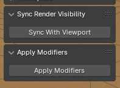
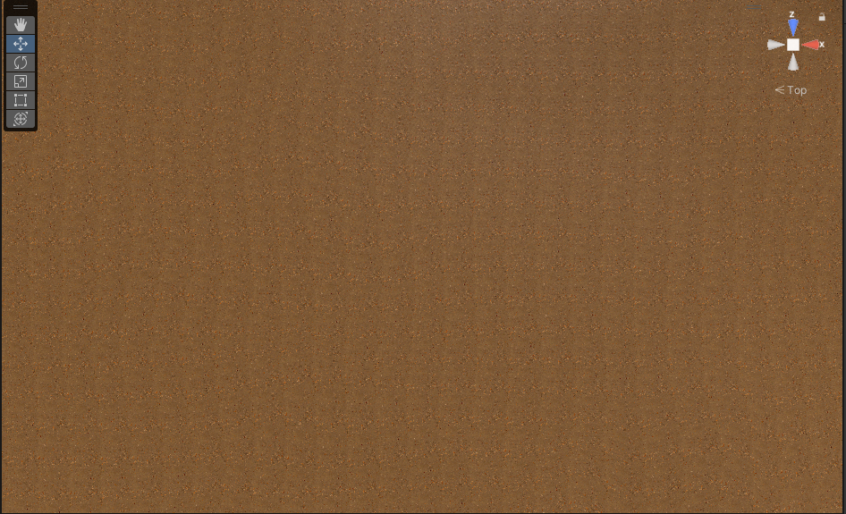
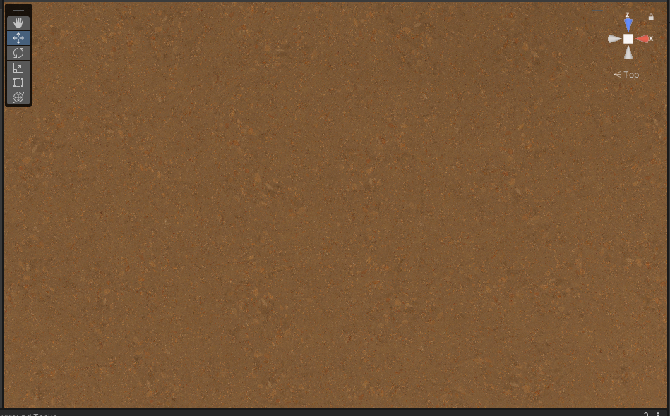

# Ruby's Random Utils

## Overview
This repository is a collection of utilities I've developed for Blender and Unity. They're not very pretty, but they do the job (most of the time). Feel free to use and modify them for your projects.

## Utilities

### Blender Add-ons
- `Sync Render Visibility`: Synchronizes the render visibility setting with the viewport visibility in Blender. It's handy for managing large scenes.

- `Apply Modifiers`: One-click button to apply all modifiers in your scene. Useful for finalizing models or making bulk changes.

### Unity Shader
- `TileBreaker`: A Unity shader that helps you break up repetitive tiling textures, giving your materials a more organic look.

## Tile Breaker Shader Documentation

### Parameters

- `Seed`: Random seed for pattern generation. Pattern is simplex noise.
- `Blend Range`: Controls the transition edges between textures in order to reduce seams.
- `Minimum Scale`: The smallest random scale for texture variation (base texture not overlay).
- `Maximum Scale`: The largest scale for texture variation (base texture not overlay).
- `Overlay Scale`: Size of the overlay texture. Defaults to 5.
- `Overlay Opacity`: Transparency of the overlay texture (blending with the broken tile).
- `Overlay Blend Range`: Edge softness of the overlay to reduce seams within the overlay.

## Installation

- **Download:** Pick the utility you need and download that file (I don't recommend to clone the repo as most files are unrelated to each other).
- **Install:** 
  - For Blender, open Blender, go to `Edit` > `Preferences` > `Add-ons` > `Install`, and select your file.
  - For Unity, drop the file into your project's `Assets` folder.

Done. Enjoy!

## Screenshots

### Blender Add-ons Preview:
  

### Unity Shader Preview:
#### Comparison of Standard Tiling vs TileBreaker Shader:
- Before: 
- After: 

## License
All tools are released under the MIT license. Do whatever you want with them — modify, distribute, or incorporate them into your own projects. Credits are appreciated though!

## Contributing
If you've found a bug, have a suggestion, or want to contribute, feel free to open an issue or a pull request.

